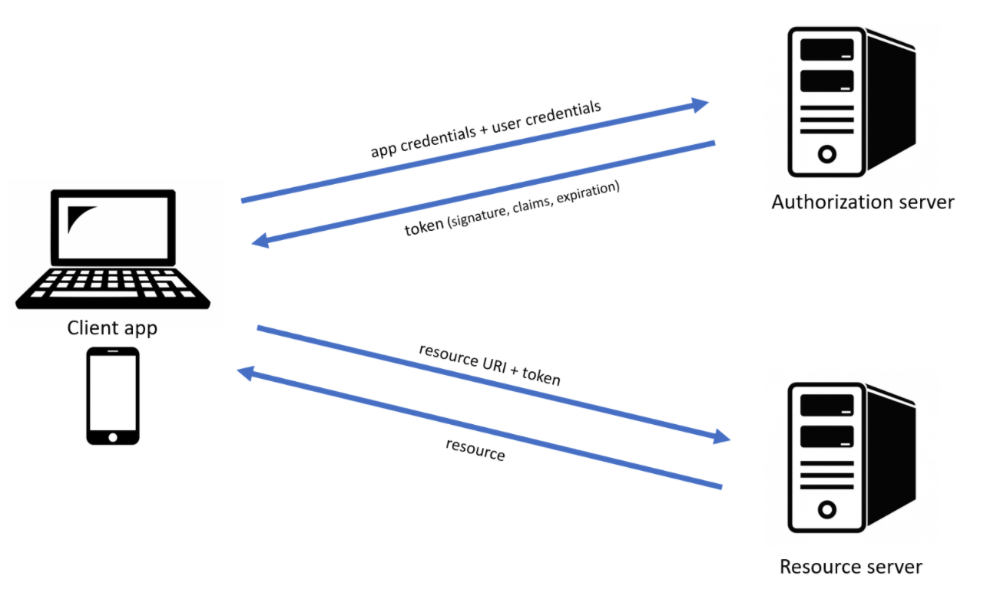
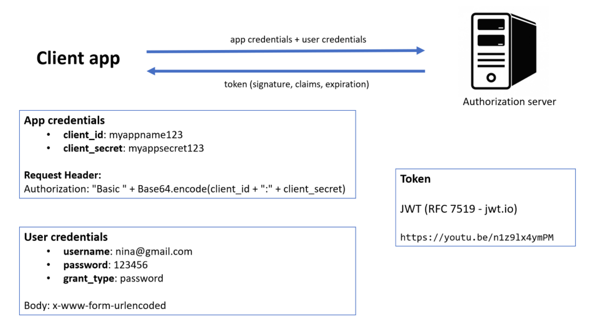
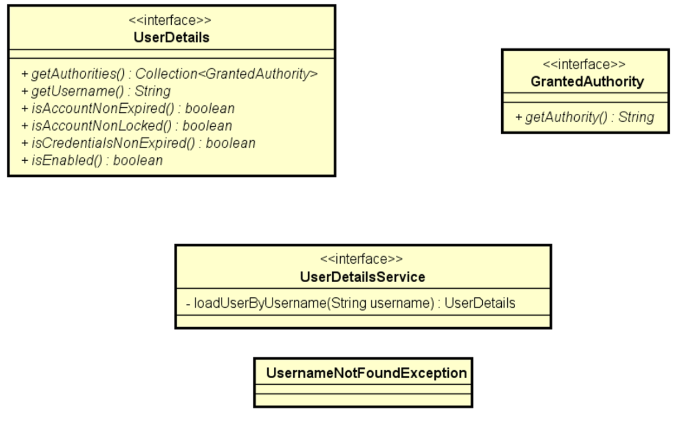

# Bootcamp Spring React 3.0 - Cap. 03
Validação e segurança

## Competências
- Modelo de dados de usuários e perfis
- Validação com Bean Validation
- Annotations
- Customizando a resposta HTTP
- Validações personalizadas com acesso a banco
- Autenticação e autorização
- Spring Security
- OAuth 2.0
- Token JWT
- Autorização de rotas por perfil
- Dicas para Postman
- Variáveis de ambiente no projeto com coalescência

## Referências sobre Bean Validation

- https://beanvalidation.org/
- https://docs.jboss.org/hibernate/beanvalidation/spec/2.0/api/overview-summary.html
- https://docs.jboss.org/hibernate/beanvalidation/spec/2.0/api/javax/validation/constraints/package-summary.html
- https://www.baeldung.com/java-bean-validation-not-null-empty-blank
- https://www.baeldung.com/spring-custom-validation-message-source
- https://pt.stackoverflow.com/questions/133691/formatar-campo-cpf-ou-cnpj-usando-regex
- https://regexr.com/
- https://regexlib.com/

## Referências token JWT, autenticação e autorização

- https://jwt.io
- https://www.youtube.com/watch?v=n1z9lx4ymPM

## OAuth 2.0

- https://oauth.net/2/

  

## Spring Security (Bean para efetuar autenticação)

